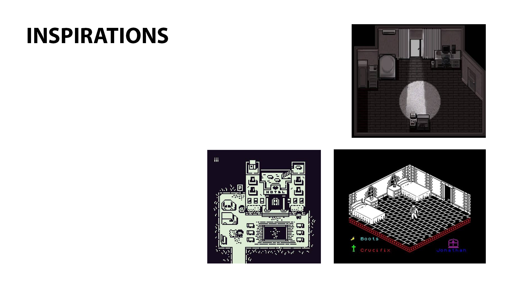

## Continuité de mon projet antérieur, cette fois avec l'aide de Stanley Olivier Vital

-Explorer la maison et son histoire, découvrir de nouvelles pièces, jouer avec les perspectives pour découvrir des chemins cachés, sortir.

-Nouvelles fonctionnalités: Deux fins possible, trouver la bonne et les pièces mobiles s'ajouterons en haut à gauche de l'écran.

-Les touches de chaques actions qui vont devoir être effectueée sont écrites entre guillemets. Ses touches seront parfois écritent toute seule et parfois elles sont intégrées dans des phrases.

-Tous les médias sonores ont été pris de la banque de médias gratuite "Pixabay". Tous les médias visuel ont été créés par moi-même et mon partenaire.

  

